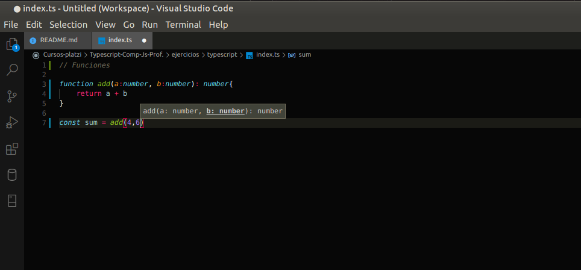
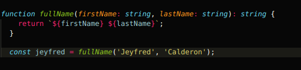
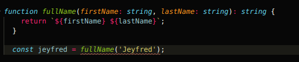
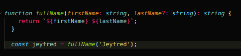

# Typescript-Comp-Js-Prof.

## Tabla de contenido 

[Introducción](#Introducción)

[Tipos básicos](#Tipos-básicos)

[Funciones](#Funciones)

[]()

[]()

[]()

[]()

[]()

[]()

[]()

[]()

[]()

[]()

[]()

[]()

## Introducción

**TypeScript** es un superset de JavaScript que añade tipado a nuestras variables y funciones.

En JavaScript no se hace esto, a una variable no hay que decirle que es un numero o que es una funcion o que una funcion regresa un objeto, etc.

TypeScript ayuda a detectar errores de forma temprana y mejorar el autocompletado, tambien mejorando toda la sintaxis para que el desarrollo sea mas agradable y seguro.

Ahora se debera instalar un servidor distinto a **liveserver** ya que este no es capaz de transpilar codigo TypeScript a JavaScript para eso se va a usar una herramienta llamada **parcel**

Como esto es una continuacion del [curso profesional de Js](https://github.com/jeyfredc/Profesional-Js#tabla-de-contenido) se puede clonar o copiar las carpetas que se tenian en el curso si se quiere empezar en un nuevo proyecto o continuar haciendolo sobre la carpeta del repositorio anterior.

Para instalar parcel abrir la consola y ubicacion del proyecto para usar npm 

`npm i -D parcel-bundler`

la `i` es de `install`, la bandera D `-D` quiere decir que este proyecto es solo para desarrollo. `parcel-bundler` cuando parcel se terminal de instalar lo que va a hacer es que va a reemplazar el script que inicia el servidor, anteriormente se estaba usando `liver-server` y ahora se va a usar parcel

A continuacion abrir el archivo **package.json** en el scripts esta live-server de esta forma

```
  "scripts": {
    "start": "live-server"
  },
```

reempĺazar "liver-server" por lo siguiente, donde estaran los html que parcel procese

```
  "scripts": {
    "start": "parcel index.html ejercicios/index.html ejercicios/**/*.html"
  },
```

Despues de las dependencias se añade una configuracion de `browserslist`, lo cual es una indicacion de cuales son los navegadores que se les va a brindar apoyo, en este caso se indica que sea la ultima version de Google Chrome `"last 1 Chrome version"`

```
{
  "name": "Curso-javascript-profesional",
  "version": "1.0.0",
  "description": "PlatziVideo",
  "license": "MIT",
  "author": "Jeyfred Calderon <jeyfredc@gmail.com>",
  "keywords": [
    "platzi"
  ],
  "scripts": {
    "start": "parcel index.html ejercicios/index.html ejercicios/**/*.html"
  },
  "devDependencies": {
    "live-server": "^1.2.1",
    "parcel-bundler": "^1.12.4"
  },
  "browserslist": [
    "last 1 Chrome version"
  ]
}

```

A continuacion guardar y en la consola se va a quitar live-server con el siguiente comando

`npm rm live-server`

Cuando ya se notifique que no esta live-server.

Ejecutar `npm start`

El nuevo servidor abrira en http://localhost:1234 pero si se pone solo no va a funcionar por tanto hay que darle la ruta asi http://localhost:1234/index.html


Dentro de la carpeta de **ejercicios** añadir una nueva carpeta que se llame **Typescript** y dentro de esta crear un archivo llamado **index.ts** la extension **ts** de **typescript** y tambien crear un archivo **index.html**

En **index.html** agregar lo siguiente

```
<html>
    <head>
        <title>TypeScript</title>
    </head>
    <body>
        <script src="/ejercicios/typescript/index.ts"></script>
    </body>
</html>
```

y cargar la ruta en el navegador al archivo que se acaba de crear es decir http://localhost:1234/ejercicios/typescript/index.html

Si aparece esta imagen lo que se debe hacer es desconectar del servidor


Dirigir a la terminal y con el teclado hacer **Ctrl + c**

Es comun que se tengan que borrar dos carpetas las cuales son **.cache** y **dist**

Para borrarlas en la terminal escribir `rm -rf .cache dist` y nuevamente iniciar el servidor con `npm start`

Despues de esto nuevamente regresar al navegador refrescarlo y ya debe aparecer la pantalla en blanco y a continuacion abrir la consola del navegador con **Ctrl + Shift + i**


En el archivo **index.ts** agregar la siguiente linea

`console.log('Hello World!')` -> hasta el momento esto es JavaScript y se imprime en la consola del navegador

La siguiente funcion ya tiene typescript porque se esta haciendo tipado y tanto `a` como a `b` se les esta indicando que son numeros

```
console.log('Hello World!')

function add (a: number,b: number){
    return a + b ;
}

const sum = add(4 , 6);

console.log(sum)

```

Esto es lo que se obtiene en el navegador


## Tipos básicos

En el archivo `.gitignore`

añadir lo siguiente para no subir cache al repositorio

```
node_modules
.cache
lib
```

**Tipos:**

- **boolean.** Valor verdadero o falso.

- **number.** Números.

- **string.** Cadenas de texto.

- **string[].** Arreglo del tipo cadena de texto.

- **Array.** Arreglo multi-tipo, acepta cadenas de texto o números.

- **enum.** Es un tipo especial llamado enumeración.

- **any.** Cualquier tipo.

- **object.** Del tipo objeto.


Dentro del archivo **index.ts** ahora añadir lo siguiente 

```
// Boolean
let muted = true;
```

Esto lo entiende el navegador pero si se quiere ser mas especifico se puede utilizar `: boolean` para especificar el tipado de la variable

```
// Boolean
let muted: boolean = true;
muted = false;
```
por ejemplo si se quisiera agregar una cadena de caracteres a muted inmediatamente va a salir un error 


Siguiente estan los numeros que de nuevo typescript lo entiende de esta forma

```
// numeros
let numerador = 42;
let denominador = 6;
let resultado = numerador / denominador;
```

Pero si se quiere ser mas especifico se puede utilizar `: number` para especificar el tipado de la variable

```
// numeros
let numerador: number = 42;
let denominador: number = 6;
let resultado: number = numerador / denominador;
```

por ejemplo si se quisiera guardar una variable que contenga un 6 pero entre cadena de caracter va a arrojar un error 


Siguiente estan los string que de nuevo typescript lo entiende de esta forma

```
// string
let nombre : string = 'Jeyfred';
let saludo = `Me llamo ${nombre}`;
```

Aunque saludo no esta especifico que es de tipo string typescript detecta que asi lo es y por tanto no arroja un error

Siguiente estan los arreglos, en typescript se puede definir si quiere que el arreglo que sea de un tipo especifico o de varios, es decir que un arreglo contenga solo numeros o solo cadenas y tambien definir si se quiere de varios tipos, cadenas, numeros y booleanos

```
// Arreglos
let people: string[] = [];
people = ['Isabel', 'Nicole', 'Raul'];
people.push('Roberto');
```

En este caso el arreglo es de strings pero si se intentara hacer push de un numero arrojaria un error 


Si se quiere un arreglo de string y numeros entonces se utiliza el keyword `Array` y entre `<>` se especifica el tipado, utilizando `|`

```
let peopleAndNumbers: Array< string | number > = [];
peopleAndNumbers.push('Gonzalo');
peopleAndNumbers.push('Ricardo');
peopleAndNumbers.push('Federico');
peopleAndNumbers.push(1000);
peopleAndNumbers.push(20000);
peopleAndNumbers.push(15000000);
```

Siguiente esta `enum` que son un conjunto de valores que son los que se definan, no se puede agregar ni quitar nada 

```
//enum
enum Color {
    Rojo,
    Verde,
    Azul,
}
```

se utilizar la variable se asigna el tipo Color pero `Color.` esta obligado a utilizar uno de los 3 valores disponibles en Color


y si se agrega un `console.log` el resultado que se esperaria es el nombre del color

```
// enum
enum Color {
    Rojo,
    Verde,
    Azul,
}

let colorFavorito: Color = Color.Azul;

console.log(`Mi color favorito es ${colorFavorito}`);
```

A continuacion lo que pasa es lo siguiente 


En la consola sale "Mi color favorito es 2"

Lo que sucede es que cuando se hace una lista de enum a cada valor le va a asignar un numero

es decir Rojo es 0, Verde es 1, Azul es 2, etc.

Para poder ser explicito hay que asignar cada valor y si asigna al menos un valor el resto tambien se debe asignar

```
// enum
enum Color {
    Rojo = "Rojo",
    Verde = "Verde",
    Azul = "Azul",
}

let colorFavorito: Color = Color.Azul;

console.log(`Mi color favorito es ${colorFavorito}`);
```


En este caso ya sale "Mi color favorito es Azul"

Siguiente esta `Any`, si se utiliza de la siguiente forma typescript va a arrojar un error

```
let comodin = 'Joker';
comodin = { type: 'Wildcard'};
```


En cambio si se utiliza el tipo `any` no va a salir ningun error, porque esto hace que la variable sea de cualquier tipo de dato

```
let comodin: any = 'Joker';
comodin = { type: 'Wildcard'};
```


Siguiente esta Object pero si se quiere ser mas especifico se puede utilizar `: object` para especificar el tipado de la variable

```
// Object

let someObject = { type: 'Wilcard' };
```

Siendo especifico se escribiria de la siguiente forma

```
// Object

let someObject : object = { type: 'Wilcard' };
```

typescript permite ser especifico con el tipo de variables pero existen otro tipos basicos que se pueden consultar en la [documentacion](https://www.typescriptlang.org/docs/handbook/basic-types.html)

## Funciones

En Typescript podemos ser explícitos con el tipo de los argumentos y el tipo de retorno de una función.

Abrir el archivo **index.ts** y a continuacion se va a realizar una funcion que suma numeros

Esta funcion se pudiera escribir de la siguiente forma

```
// Funciones

function add(a, b){
    return a + b
}

const sum = add(4,6)
```

Pero con typescript es posible especificar el tipo de variable y de funcion de esta forma

```
// Funciones

function add(a:number, b:number): number{
    return a + b
}

const sum = add(4,6);
```

El hacer esto proporciona que el lenguaje proporcione ayudas como la de mostrar entre los parentesis donde se pone 4 y 6 que son de tipo numerico 



Hay veces que las funciones regresan otras funciones a continuacion se va a agregar una funcion que es creador de sumas

```
function createAdder(a: number){
  return function(b: number){
    return b+a
  }
}
```

Es posible ser mas especifico y decire a la funcion que tipo de valor es el que va a retornar. Como el valor de retorno es una funcion se anota de esta forma `:()=>`, se especifican los parametros y el tipo de valor de retorno

```
function createAdder(a:number): (number) => number {
    return function (b:number){
        return b + a;
    }
}

const addFour = createAdder(4);
const fourPlus6 = addFour(6);
```

No todos los parametros o argumentos son obligatorios, algunos son opcionales. Para esto una funcion que escribe el nombre completo 

```
function fullName(firstName: string, lastName: string): string {
  return `${firstName} ${lastName}`;
}

const jeyfred = fullName('Jeyfred', 'Calderon');
```

hasta este momento la funcion no tiene ningun problema porque todo esta tal y como se esta pidiendo 



Al quitar un parametro en la constante se marca un error 



Para que el otro parametro sea opcional por ejemplo en lastName se agrega un signo de pregunta `?: tipo de dato`

```
function fullName(firstName: string, lastName?: string): string {
  return `${firstName} ${lastName}`;
}

const jeyfred = fullName('Jeyfred');
```

De esta manera pasar un solo argumento en la funcion es valido



Si se quiere que no sea opcional, si no por omision delante de la palabra string se establece un argumento que se va a llamar por omision

```
function fullName(firstName: string, lastName: string = 'Smith'): string {
  return `${firstName} ${lastName}`;
}

const jeyfred = fullName('Jeyfred');
```